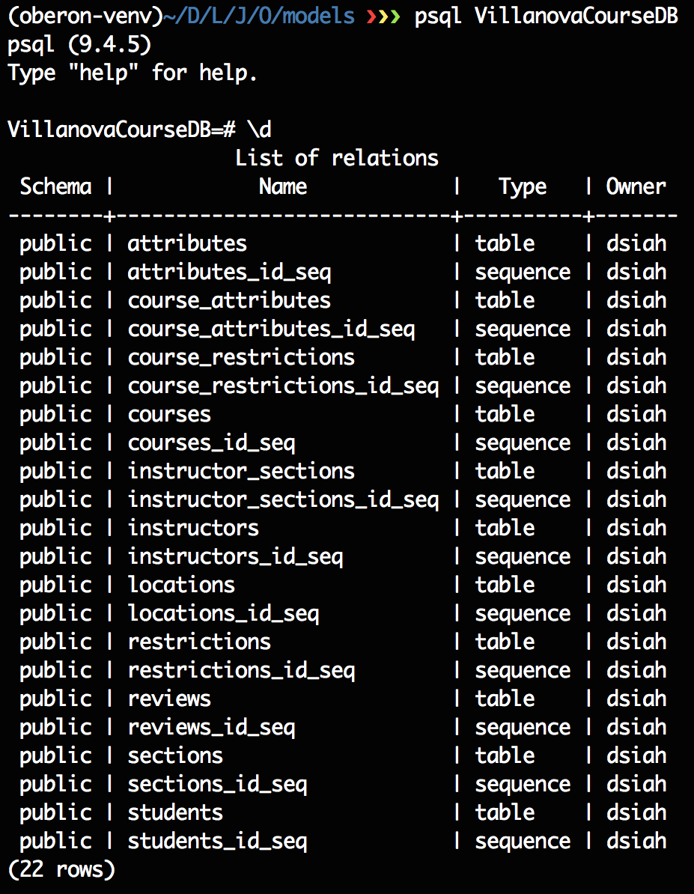

# Oberon
Collection Engine for courses

## Local Scraping Database Setup Instructions


### Install Postgres [OSX for now]

0. ```brew doctor``` to make sure your package manager is running properly
1. ```brew update``` to update brew package links
2. ```brew install postgres``` to install postgresql
3. Read the Caveats (I personally boot psql each time I want to work but you can also setup 
background / startup processes. Here's a good [link for that](https://www.codefellows.org/blog/three-battle-tested-ways-to-install-postgresql))
3. ```which psql``` should match /usr/local/bin/psql
4. Boot by typing ```psql``` in your shell


### How to Initialize your DB

1. ```createdb VillanovaCourseDB```
2. Make sure your credentials are in the root of the local repository and then run ```python models.py```
3. Now try this ```psql VillanovaCourseDB``` and you should be presented with the CLI for postgres
you can even see your tables and relations by typing ```\d``` in the CLI





### Recap

1. Install Postgres correctly
2. Create the Database 
3. Run the models script and check for errors (report an issue if you find any errors)
